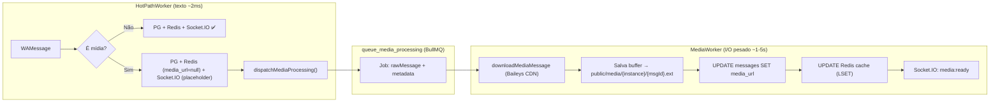

# Walkthrough — Motor de Mensageria WhatsApp

## Correções Implementadas (Bugs 1-3)

| Bug | Causa Raiz | Correção | Arquivos |
|---|---|---|---|
| QR Modal não fecha | Backend não emitia Socket.IO | `session:connected` event + listener no frontend | [req.js](file:///c:/Users/rui/Desktop/chat.scoremark1.com/middlewares/req.js), [chatEngine.ts](file:///c:/Users/rui/Desktop/chat.scoremark1.com/frontend/core/chatEngine.ts), [Sessions/page.tsx](file:///c:/Users/rui/Desktop/chat.scoremark1.com/frontend/pages/Sessions/page.tsx) |
| Avatar sessão ausente | [fetchProfileUrl](file:///c:/Users/rui/Desktop/chat.scoremark1.com/functions/control.js#5-27) sem retry | Retry com delay (3-5s) | [req.js](file:///c:/Users/rui/Desktop/chat.scoremark1.com/middlewares/req.js) |
| Avatares Inbox | `profile_image` nunca populado | Batch fetch + lazy fill | [req.js](file:///c:/Users/rui/Desktop/chat.scoremark1.com/middlewares/req.js), [inbox.js](file:///c:/Users/rui/Desktop/chat.scoremark1.com/routes/inbox.js) |

---

## Auditoria Arquitetural

| Camada | Status |
|---|---|
| Baileys → BullMQ (desbloqueio do Node) | ✅ OK |
| Workers → PG + Redis (write-through) | ✅ OK |
| Redis Hot Cache — Inbox | ✅ OK |
| Redis Hot Cache — Messages (`get_convo`) | ✅ Read-through já implementado |
| Socket.IO (tempo real) | ✅ OK |
| **Mídias (download assíncrono)** | ✅ **Pipeline implementado** |

---

## Etapa 4 — Pipeline Assíncrono de Mídias

### Arquitetura

### Arquivos Criados/Modificados

| Arquivo | Ação | Descrição |
|---|---|---|
| [queues.js](file:///c:/Users/rui/Desktop/chat.scoremark1.com/queues/queues.js) | MODIFY | Nova fila `queue_media_processing` (3 retries, backoff exponencial 5s) |
| [producers.js](file:///c:/Users/rui/Desktop/chat.scoremark1.com/queues/producers.js) | MODIFY | [dispatchMediaProcessing()](file:///c:/Users/rui/Desktop/chat.scoremark1.com/queues/producers.js#177-203) — despacha rawMessage + metadata para fila |
| [workers.js](file:///c:/Users/rui/Desktop/chat.scoremark1.com/queues/workers.js) | MODIFY | `MEDIA_TYPES` set + bypass no HotPath + boot wiring do MediaWorker |
| [mediaWorker.js](file:///c:/Users/rui/Desktop/chat.scoremark1.com/queues/mediaWorker.js) | **NEW** | Worker completo: download → disco → PG → Redis → Socket.IO |
| [server.js](file:///c:/Users/rui/Desktop/chat.scoremark1.com/server.js) | MODIFY | `express.static('/media/')` para servir mídia baixada (cache 7d) |
| [chatEngine.ts](file:///c:/Users/rui/Desktop/chat.scoremark1.com/frontend/core/chatEngine.ts) | MODIFY | Registra evento `media:ready` no Socket.IO do frontend |

### Fluxo Detalhado

1. **Baileys recebe mensagem de mídia** (ex: `imageMessage`) → [dispatchHotPath()](file:///c:/Users/rui/Desktop/chat.scoremark1.com/queues/producers.js#149-172)
2. **HotPathWorker processa** — persiste metadados no PG com `media_url = null`, emite `push_new_msg` via Socket.IO (frontend mostra placeholder/spinner)
3. **HotPathWorker detecta `MEDIA_TYPES`** → [dispatchMediaProcessing(rawMsg, extractedMsg, instanceId, uid)](file:///c:/Users/rui/Desktop/chat.scoremark1.com/queues/producers.js#177-203)
4. **MediaWorker consome** — [downloadMediaMessage()](file:///c:/Users/rui/Desktop/chat.scoremark1.com/middlewares/req.js#894-898) (Baileys decripta do CDN WhatsApp) → salva buffer em `public/media/{instanceId}/{msgId}.{ext}`
5. **MediaWorker atualiza PG** — `UPDATE messages SET media_url = '/media/...'`
6. **MediaWorker atualiza Redis** — `LSET` na lista `msgs:{instanceId}:{chatId}` com `media_url` preenchido
7. **MediaWorker emite Socket.IO** — `media:ready` com `{ msgId, chatId, mediaUrl, mediaType }`
8. **Frontend recebe `media:ready`** via [chatEngine.ts](file:///c:/Users/rui/Desktop/chat.scoremark1.com/frontend/core/chatEngine.ts) → atualiza a UI substituindo o placeholder pela mídia real

### Configuração

| Parâmetro | Valor Default | ENV |
|---|---|---|
| Concorrência MediaWorker | 3 | `MEDIA_WORKER_CONCURRENCY` |
| Retries | 3 (exponential 5s/10s/20s) | Configurado na Queue |
| Storage | `public/media/{instanceId}/` | — |
| Cache HTTP de mídia | 7 dias | `maxAge: '7d'` no express.static |
| Tipos suportados | image, video, audio, document, sticker | `MEDIA_TYPES` em workers.js |
