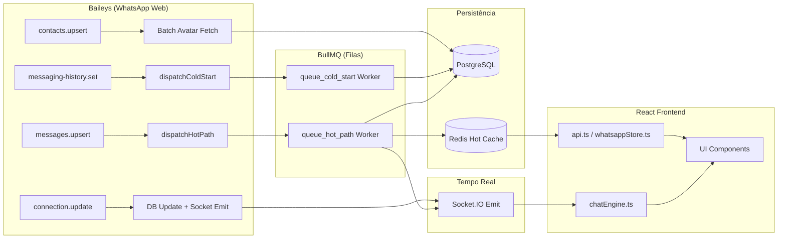

# Auditoria Arquitetural — Motor de Mensageria WhatsApp

## Resumo das Correções

### Bug 1 — Modal QR não fecha ao conectar ✅

| Componente | Arquivo | Mudança |
|---|---|---|
| **Backend** | [req.js](file:///c:/Users/rui/Desktop/chat.scoremark1.com/middlewares/req.js) | Emite `session:connected` via Socket.IO no handler `connection === "open"` |
| **Frontend Engine** | [chatEngine.ts](file:///c:/Users/rui/Desktop/chat.scoremark1.com/frontend/core/chatEngine.ts) | Registra listener para evento `session:connected` |
| **Frontend Page** | [Sessions/page.tsx](file:///c:/Users/rui/Desktop/chat.scoremark1.com/frontend/pages/Sessions/page.tsx) | `useEffect` escuta `session:connected` e fecha o modal (`setQrData(null)`) |

**Fluxo**:
1. WhatsApp autentica → Baileys dispara `connection.update` com `connection === "open"`
2. Backend atualiza DB (`instance.status = 'CONNECTED'`)
3. Backend emite `io.to(socketId).emit('session:connected', { sessionId, userData })`
4. Frontend recebe via chatEngine → fecha modal instantaneamente
5. Polling HTTP de 3s mantido como **fallback** caso o Socket falhe

---

### Bug 2 — Avatar da sessão ausente ✅

| Componente | Arquivo | Mudança |
|---|---|---|
| **Backend** | [req.js](file:///c:/Users/rui/Desktop/chat.scoremark1.com/middlewares/req.js) | Retry em [trySaveOwnAvatar](file:///c:/Users/rui/Desktop/chat.scoremark1.com/middlewares/req.js#266-290) (5s delay) e no handler `connection.open` (3s delay) |

**Fluxo**:
1. [trySaveOwnAvatar()](file:///c:/Users/rui/Desktop/chat.scoremark1.com/middlewares/req.js#266-290) tenta [fetchProfileUrl(wa, myJid)](file:///c:/Users/rui/Desktop/chat.scoremark1.com/functions/control.js#5-27) → se falhar, espera 5s e tenta novamente
2. Handler `connection === "open"` tenta [fetchProfileUrl(wa, jid)](file:///c:/Users/rui/Desktop/chat.scoremark1.com/functions/control.js#5-27) → se falhar, espera 3s e tenta novamente
3. URL do avatar é salva em `instance.userData` (JSON) no PostgreSQL
4. Frontend lê `userData.imgUrl` via `api.ts:getWhatsAppInstances` → monta `avatar` no card

---

### Bug 3 — Avatares ausentes na Inbox ✅

| Componente | Arquivo | Mudança |
|---|---|---|
| **Backend** | [req.js](file:///c:/Users/rui/Desktop/chat.scoremark1.com/middlewares/req.js) | Batch fetch em `contacts.upsert` (50 contatos, 500ms throttle) |
| **Backend** | [inbox.js](file:///c:/Users/rui/Desktop/chat.scoremark1.com/routes/inbox.js) | Lazy fill em `get_my_chats` (20 chats, 500ms throttle) |

**Fluxo (duas vias)**:
1. **Proativo**: Quando o Baileys emite `contacts.upsert`, o backend faz batch fetch de avatares (até 50 contatos, 500ms entre cada) e grava `profile_image` no PG
2. **Reativo**: Quando o frontend carrega a Inbox (`get_my_chats`), após enviar a resposta, o backend faz lazy fill de chats sem `profile_image` (até 20, 500ms entre cada)
3. No **segundo reload**, avatares já estão populados no PG → Redis cache → Frontend

---

## Auditoria do Fluxo de Dados

### Análise por Camada

#### 1. Ingestão (Baileys → BullMQ) ✅
- **`messages.upsert`** → `dispatchHotPath()` — despacha instantaneamente para fila BullMQ, zero I/O de banco na thread principal
- **`messaging-history.set`** → `dispatchColdStart()` — chunks de histórico massivo são fatiados e enviados para Redis/BullMQ
- **Veredito**: ✅ Implementação correta. O Node.js é desbloqueado imediatamente.

#### 2. Workers (BullMQ → PostgreSQL + Redis) ✅
- **HotPathWorker** ([workers.js](file:///c:/Users/rui/Desktop/chat.scoremark1.com/queues/workers.js)): 
  - `INSERT` na tabela `messages` (PostgreSQL)
  - `UPSERT` na tabela `chats` (PostgreSQL)
  - Write-through para Redis (ZSET inbox, HASH chat, LIST messages)
  - Emite via Socket.IO (`push_new_msg`, `update_conversations`)
- **ColdStartWorker** ([workers.js](file:///c:/Users/rui/Desktop/chat.scoremark1.com/queues/workers.js)):
  - Bulk insert de mensagens históricas
  - Atualiza chats existentes
- **Veredito**: ✅ Write-through pattern correto. PostgreSQL e Redis são atualizados atomicamente.

#### 3. Cache Layer (Redis Hot Cache) ✅
- **[cache.js](file:///c:/Users/rui/Desktop/chat.scoremark1.com/queues/cache.js)** implementa:
  - [cacheGetInbox(instance)](file:///c:/Users/rui/Desktop/chat.scoremark1.com/queues/cache.js#117-174) — Redis ZSET com score = timestamp → latência ~0.5ms
  - [cacheWarmInbox(instance, data)](file:///c:/Users/rui/Desktop/chat.scoremark1.com/queues/cache.js#175-212) — aquece cache a partir de dados PG
  - `cacheSetMessages(chatId, messages)` — Redis LIST para mensagens recentes
- **Veredito**: ✅ Redis é consultado primeiro. PostgreSQL é fallback apenas em cache miss.

#### 4. Leitura Frontend (API → Redis → React) ✅

| Endpoint | Lê de | Fallback |
|---|---|---|
| `GET /api/inbox/get_my_chats` | Redis ([cacheGetInbox](file:///c:/Users/rui/Desktop/chat.scoremark1.com/queues/cache.js#117-174)) | PostgreSQL (cache miss → warm) |
| `POST /api/user/get_convo` | PostgreSQL direto | — |
| `GET /api/session/get_mine` | PostgreSQL direto | — |
| `GET /api/session/get_instances_with_status` | PostgreSQL direto | — |

> [!WARNING]
> **Ponto de Atenção**: O endpoint `get_convo` (histórico de mensagens de um chat) lê **diretamente do PostgreSQL**, não do Redis. Para cargas de alta volumetria, considerar migrar para leitura do Redis LIST (já existe `cacheSetMessages` mas apenas para write-through — sem read-through no endpoint).

> [!NOTE]
> Os endpoints de sessão (`get_mine`, `get_instances_with_status`) leem do PostgreSQL, o que é aceitável dado que são tabelas pequenas e operações pouco frequentes.

#### 5. Tempo Real (Socket.IO → React) ✅
- **[realtime.js](file:///c:/Users/rui/Desktop/chat.scoremark1.com/queues/realtime.js)**: Bridge entre BullMQ workers e Socket.IO global
  - Emite `push_new_msg` e `update_conversations` para o room do usuário
- **[chatEngine.ts](file:///c:/Users/rui/Desktop/chat.scoremark1.com/frontend/core/chatEngine.ts)**: Singleton no frontend que conecta ao Socket.IO e distribui eventos
  - Suporta: `push_new_msg`, `update_conversations`, `session:connected` (novo), `user:typing`, `push_new_reaction`
- **Veredito**: ✅ Padrão correto. O frontend reage em tempo real.

---

## Resumo da Auditoria

| Camada | Status | Observação |
|---|---|---|
| Baileys → BullMQ | ✅ OK | Zero I/O na thread principal |
| Workers → PG + Redis | ✅ OK | Write-through correto |
| Redis Hot Cache (Inbox) | ✅ OK | Cache-first com fallback PG |
| Redis Hot Cache (Messages) | ⚠️ | Write-through OK, mas **read-through ausente** em `get_convo` |
| Socket.IO (Tempo Real) | ✅ OK | Eventos chegam ao frontend via chatEngine |
| Session Status | ✅ OK | Agora emite `session:connected` (Bug 1 fix) |
| Avatares | ✅ OK | Batch + lazy fill (Bug 2 + 3 fixes) |

### Recomendação Futura
Para eliminar o último gargalo de I/O:
- Implementar **read-through** no endpoint `get_convo` para ler mensagens recentes do Redis LIST antes de consultar PostgreSQL
- A estrutura de cache (`cacheSetMessages`) já existe — falta apenas adicionar [cacheGetMessages](file:///c:/Users/rui/Desktop/chat.scoremark1.com/queues/cache.js#238-270) como first-read no handler
